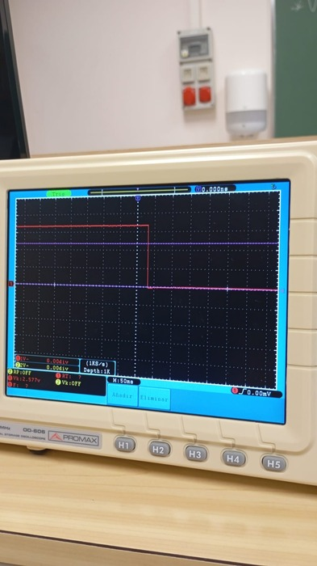
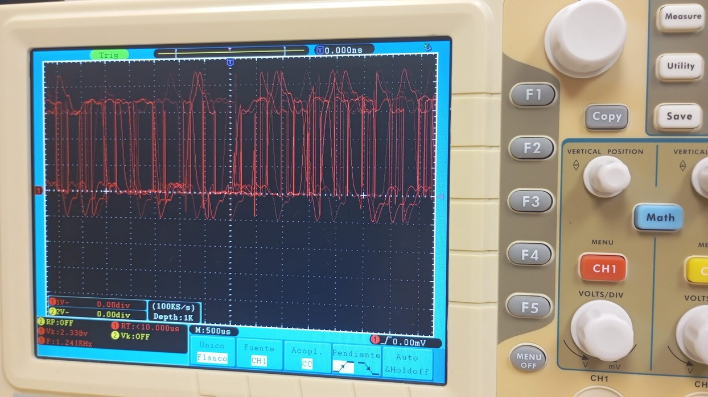

## Primera Parte
La primera parte de la práctica, utilizamos la placa **ESP32-S3** para encender el `led RGB` incorporado.
Mediante **Chat-GPT**, generamos un codigo utilizando la libreria `Adafruit-NeoPixel` que enciende y apaga el led con un delay de _500ms_.

## Segunda Parte
> **Objetivo:** encontrar mediante un *Ociloscopio* la frequencia máxima del `ESP32-S3` en diferentes situaciones.
- #### Con 500 de delay
  En esta segunda parte de la práctica, _activamos y desactivamos_ el **pin 2** cada _500ms_ dandonos la siguiente senyal.
  
  
- #### Con Serial.println
  Después, hemos hecho exactamente lo mismo, pero en vez de co un delay de _500ms_, hemos estado imprimiendo en el terminal con `Serial.println` dandonos la siguiente senyal.
  
  
- #### Sin delay
  Finalmente, hemos _quitado cualquier tipo de comportamiento_ el cual pudiese generar un retraso, dandonos una senyal **completamente aleatória** dandonos como frequencia máxima, `1.241KHz`.

    
